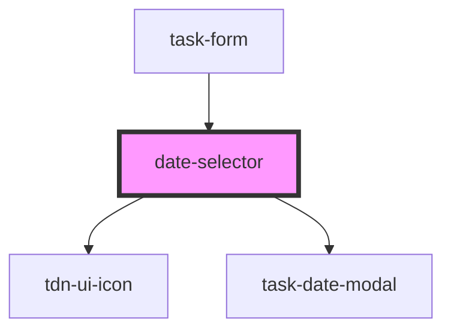

# date-selector

<!-- Auto Generated Below -->

## Events

| Event             | Description | Type               |
| ----------------- | ----------- | ------------------ |
| `dueDateSelected` |             | `CustomEvent<any>` |

## Dependencies

### Used by

 - [task-form](../task-form)

### Depends on

- [tdn-ui-icon](../design-system/icon)
- [task-date-modal](../task-date-modal)

### Graph

----------------------------------------------

*Built with [StencilJS](https://stenciljs.com/)*
