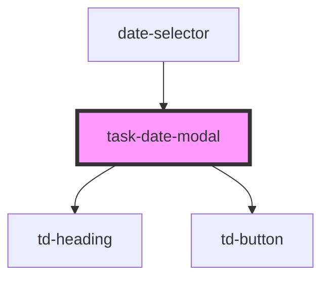

# task-date-modal

<!-- Auto Generated Below -->

## Properties

| Property                | Attribute                 | Description | Type     | Default     |
| ----------------------- | ------------------------- | ----------- | -------- | ----------- |
| `currentlySelectedDate` | `currently-selected-date` |             | `string` | `undefined` |

## Events

| Event           | Description | Type               |
| --------------- | ----------- | ------------------ |
| `dateSelection` |             | `CustomEvent<any>` |
| `modalClose`    |             | `CustomEvent<any>` |

## Dependencies

### Used by

 - [date-selector](../date-selector)

### Depends on

- [td-heading](../td-heading)
- [td-button](../td-button)

### Graph

----------------------------------------------

*Built with [StencilJS](https://stenciljs.com/)*
