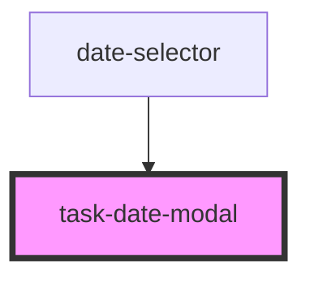

# task-date-modal

<!-- Auto Generated Below -->

## Properties

| Property                 | Attribute                  | Description | Type     | Default     |
| ------------------------ | -------------------------- | ----------- | -------- | ----------- |
| `currentDate`            | `current-date`             |             | `any`    | `undefined` |
| `currentlySelectedDay`   | `currently-selected-day`   |             | `number` | `undefined` |
| `currentlySelectedMonth` | `currently-selected-month` |             | `number` | `undefined` |
| `currentlySelectedYear`  | `currently-selected-year`  |             | `number` | `undefined` |

## Events

| Event           | Description | Type               |
| --------------- | ----------- | ------------------ |
| `dateSelection` |             | `CustomEvent<any>` |
| `modalClose`    |             | `CustomEvent<any>` |

## Dependencies

### Used by

 - [date-selector](../date-selector)

### Graph

----------------------------------------------

*Built with [StencilJS](https://stenciljs.com/)*
