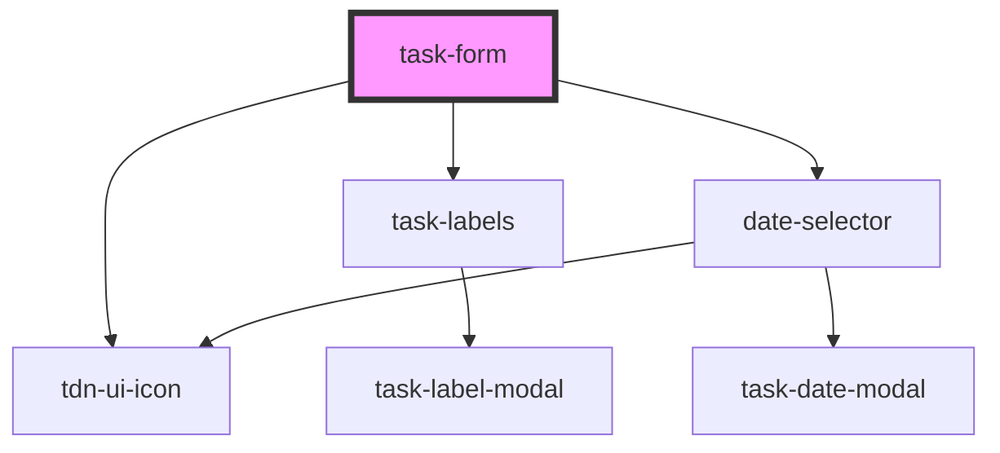

# task-form

<!-- Auto Generated Below -->

## Properties

| Property | Attribute | Description | Type    | Default     |
| -------- | --------- | ----------- | ------- | ----------- |
| `labels` | --        |             | `any[]` | `undefined` |

## Events

| Event       | Description | Type               |
| ----------- | ----------- | ------------------ |
| `taskAdded` |             | `CustomEvent<any>` |

## Dependencies

### Depends on

- [tdn-ui-icon](../design-system/icon)
- [task-labels](../task-labels)
- [date-selector](../date-selector)

### Graph

----------------------------------------------

*Built with [StencilJS](https://stenciljs.com/)*
