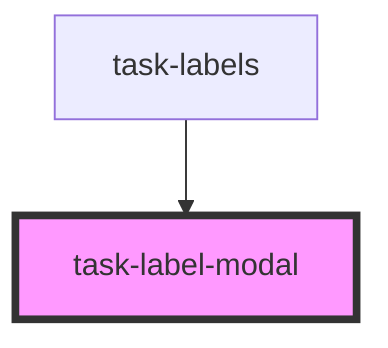

# task-label-modal

<!-- Auto Generated Below -->

## Properties

| Property                    | Attribute | Description | Type    | Default |
| --------------------------- | --------- | ----------- | ------- | ------- |
| `currentlySelectedLabelIds` | --        |             | `any[]` | `[]`    |
| `labels`                    | --        |             | `any[]` | `[]`    |

## Events

| Event            | Description | Type               |
| ---------------- | ----------- | ------------------ |
| `labelSelection` |             | `CustomEvent<any>` |
| `modalClose`     |             | `CustomEvent<any>` |

## Dependencies

### Used by

 - [task-labels](../task-labels)

### Graph

----------------------------------------------

*Built with [StencilJS](https://stenciljs.com/)*
