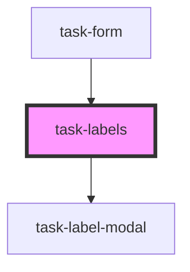

# task-labels

<!-- Auto Generated Below -->

## Properties

| Property | Attribute | Description | Type    | Default     |
| -------- | --------- | ----------- | ------- | ----------- |
| `labels` | --        |             | `any[]` | `undefined` |

## Events

| Event                | Description | Type               |
| -------------------- | ----------- | ------------------ |
| `taskLabelsSelected` |             | `CustomEvent<any>` |

## Dependencies

### Used by

 - [task-form](../task-form)

### Depends on

- [task-label-modal](../task-label-modal)

### Graph

----------------------------------------------

*Built with [StencilJS](https://stenciljs.com/)*
