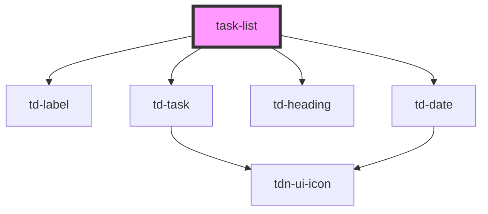

# task-list

<!-- Auto Generated Below -->

## Properties

| Property | Attribute | Description | Type    | Default |
| -------- | --------- | ----------- | ------- | ------- |
| `labels` | --        |             | `any[]` | `[]`    |
| `tasks`  | --        |             | `any[]` | `[]`    |

## Dependencies

### Depends on

- [td-label](../td-label)
- [td-task](../td-task)
- [td-heading](../td-heading)
- [td-date](../td-date)

### Graph

----------------------------------------------

*Built with [StencilJS](https://stenciljs.com/)*
