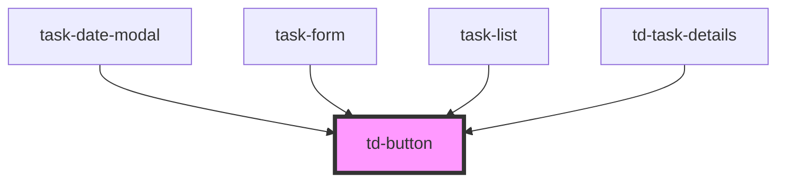

# td-button

<!-- Auto Generated Below -->

## Properties

| Property     | Attribute     | Description | Type       | Default    |
| ------------ | ------------- | ----------- | ---------- | ---------- |
| `buttonText` | `button-text` |             | `string`   | `""`       |
| `handler`    | --            |             | `Function` | `() => {}` |
| `iconName`   | `icon-name`   |             | `string`   | `""`       |
| `type`       | `type`        |             | `string`   | `""`       |

## Events

| Event             | Description | Type               |
| ----------------- | ----------- | ------------------ |
| `tdButtonClicked` |             | `CustomEvent<any>` |

## Dependencies

### Used by

 - [task-date-modal](../task-date-modal)
 - [task-form](../task-form)
 - [task-list](../task-list)
 - [td-task-details](../td-task-details)

### Graph

----------------------------------------------

*Built with [StencilJS](https://stenciljs.com/)*
