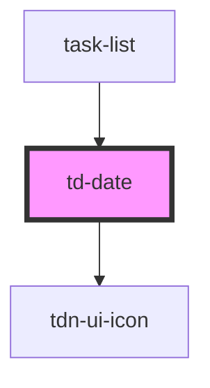

# td-date

<!-- Auto Generated Below -->

## Properties

| Property | Attribute | Description | Type     | Default |
| -------- | --------- | ----------- | -------- | ------- |
| `date`   | `date`    |             | `string` | `""`    |

## Dependencies

### Used by

 - [task-list](../task-list)

### Depends on

- [tdn-ui-icon](../design-system/icon)

### Graph

----------------------------------------------

*Built with [StencilJS](https://stenciljs.com/)*
