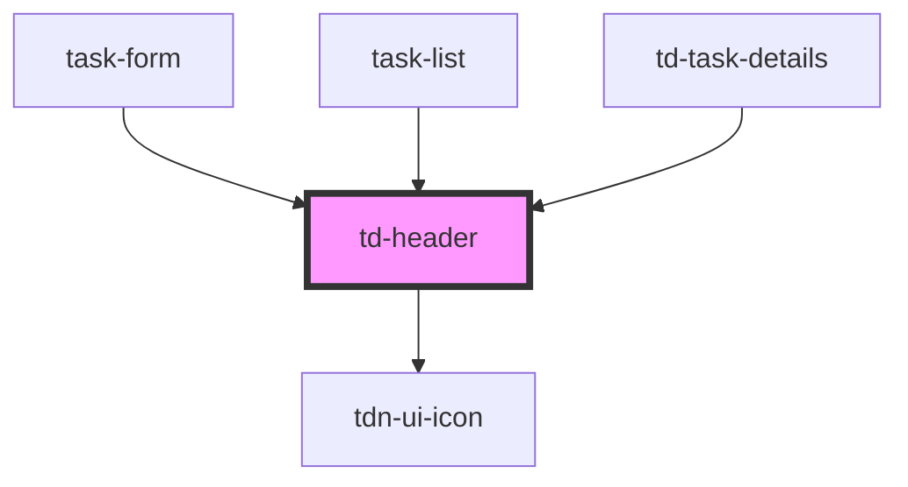

# td-header

<!-- Auto Generated Below -->

## Properties

| Property     | Attribute     | Description | Type     | Default |
| ------------ | ------------- | ----------- | -------- | ------- |
| `headerCopy` | `header-copy` |             | `string` | `""`    |

## Events

| Event           | Description | Type               |
| --------------- | ----------- | ------------------ |
| `headerClicked` |             | `CustomEvent<any>` |

## Dependencies

### Used by

 - [task-form](../task-form)
 - [task-list](../task-list)
 - [td-task-details](../td-task-details)

### Depends on

- [tdn-ui-icon](../design-system/icon)

### Graph

----------------------------------------------

*Built with [StencilJS](https://stenciljs.com/)*
