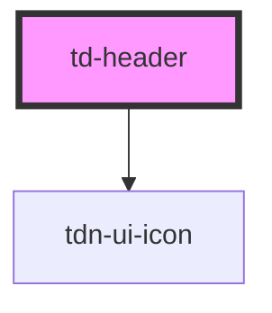

# td-header

<!-- Auto Generated Below -->

## Properties

| Property     | Attribute     | Description | Type     | Default |
| ------------ | ------------- | ----------- | -------- | ------- |
| `headerCopy` | `header-copy` |             | `string` | `""`    |

## Dependencies

### Depends on

- [tdn-ui-icon](../design-system/icon)

### Graph

----------------------------------------------

*Built with [StencilJS](https://stenciljs.com/)*
