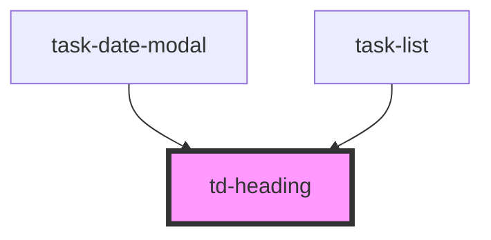

# td-heading

<!-- Auto Generated Below -->

## Properties

| Property      | Attribute      | Description | Type     | Default     |
| ------------- | -------------- | ----------- | -------- | ----------- |
| `headingText` | `heading-text` |             | `string` | `undefined` |
| `type`        | `type`         |             | `string` | `undefined` |

## Dependencies

### Used by

 - [task-date-modal](../task-date-modal)
 - [task-list](../task-list)

### Graph

----------------------------------------------

*Built with [StencilJS](https://stenciljs.com/)*
