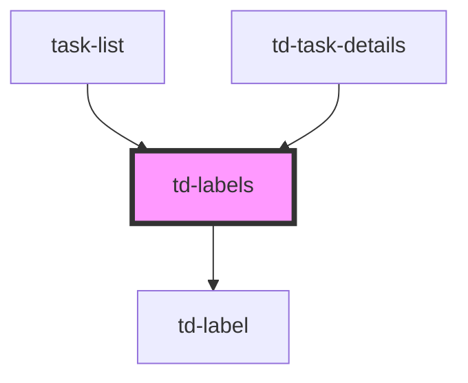

# td-labels

<!-- Auto Generated Below -->

## Properties

| Property         | Attribute | Description | Type    | Default |
| ---------------- | --------- | ----------- | ------- | ------- |
| `labels`         | --        |             | `any[]` | `[]`    |
| `selectedLabels` | --        |             | `any[]` | `[]`    |

## Dependencies

### Used by

 - [task-list](../task-list)
 - [td-task-details](../td-task-details)

### Depends on

- [td-label](../td-label)

### Graph

----------------------------------------------

*Built with [StencilJS](https://stenciljs.com/)*
