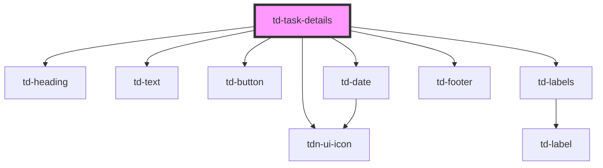

# td-task-details

<!-- Auto Generated Below -->

## Properties

| Property   | Attribute  | Description | Type      | Default     |
| ---------- | ---------- | ----------- | --------- | ----------- |
| `complete` | `complete` |             | `boolean` | `undefined` |
| `labels`   | --         |             | `any[]`   | `[]`        |
| `task`     | `task`     |             | `any`     | `{}`        |

## Events

| Event                | Description | Type               |
| -------------------- | ----------- | ------------------ |
| `taskEdit`           |             | `CustomEvent<any>` |
| `taskMarkedComplete` |             | `CustomEvent<any>` |

## Dependencies

### Depends on

- [tdn-ui-icon](../design-system/icon)
- [td-heading](../td-heading)
- [td-text](../td-text)
- [td-button](../td-button)
- [td-labels](../td-labels)
- [td-date](../td-date)
- [td-footer](../td-footer)

### Graph

----------------------------------------------

*Built with [StencilJS](https://stenciljs.com/)*
