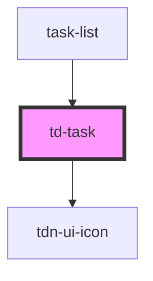

# td-task

<!-- Auto Generated Below -->

## Properties

| Property       | Attribute       | Description | Type     | Default     |
| -------------- | --------------- | ----------- | -------- | ----------- |
| `thumbnailUrl` | `thumbnail-url` |             | `string` | `undefined` |

## Dependencies

### Used by

 - [task-list](../task-list)

### Depends on

- [tdn-ui-icon](../design-system/icon)

### Graph

----------------------------------------------

*Built with [StencilJS](https://stenciljs.com/)*
