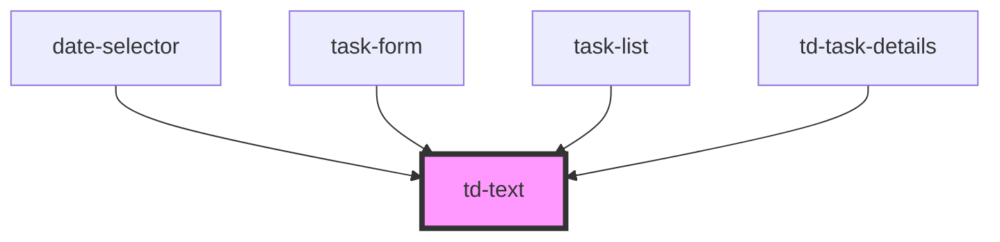

# td-text

<!-- Auto Generated Below -->

## Properties

| Property | Attribute | Description | Type     | Default |
| -------- | --------- | ----------- | -------- | ------- |
| `text`   | `text`    |             | `string` | `""`    |
| `type`   | `type`    |             | `string` | `""`    |

## Dependencies

### Used by

 - [date-selector](../date-selector)
 - [task-form](../task-form)
 - [task-list](../task-list)
 - [td-task-details](../td-task-details)

### Graph

----------------------------------------------

*Built with [StencilJS](https://stenciljs.com/)*
